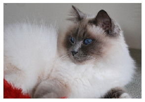

# Computer Vision Introduction (Beginner)
> A quick overview of the main features in the vision API


---
This article is also a Jupyter Notebook available to be run from the top down. There
will be code snippets that you can then run in any environment.

Below are the versions of `fastai`, `fastcore`, and `pillow` currently running at the time of writing this:
* `fastai`: 2.0.14 
* `fastcore`: 1.0.11 
* `pillow`: 7.1.2 
---


## General Components of the Vision API

In this notebook we'll be looking at the main bits and pieces that revolve around the Computer Vision sublibrary in `fastai`. We won't train a model, instead we'll show a few functions specific to vision, brielfly explain at a high level what they do, and show examples.

### Opening Images

`fastai` utilizes the `Pillow` library to open images and apply transforms. To open up any image using `Pillow` inside the `fastai` library, we have `PILImage.create`:

```
from fastai.vision.all import *
```

We'll quickly grab the `PETS` dataset to examine colored images:

```
path = untar_data(URLs.PETS)
fnames = get_image_files(path/'images')
```

And open one of them with their filename:

```
im = PILImage.create(fnames[0])
```

We can show the image with `im.show()`:

```
im.show()
```


    <matplotlib.axes._subplots.AxesSubplot at 0x7f8f47da2a50>





We can also call the usual functions you may inside of `Pillow`, such as `.shape` and `.size`:

```
im.shape, im.size
```


    ((343, 500), (500, 343))


`PILImage` can accept a varity of inputs to cover the most common types you will see in the wild:
  * `TensorImage` (`fastai` specific)
  * `TensorMask` (`fastai` specific)
  * A `Tensor`
  * A `ndarray`
  * Bytes (note that it will call `io.BytesIO` to open it)
  * Else it will call `Pillow`'s `Image.open` function

We can also have black and white images, which has it's own `PIL` denomer, `PILImageBW`. We'll see an example with `MNIST` below:

```
path_m = untar_data(URLs.MNIST_SAMPLE)
imgs = get_image_files(path_m/'train')
```

```
im_bw = PILImageBW.create(imgs[0])
```

And we can show just like the previous one:

```
im_bw.show()
```


    <matplotlib.axes._subplots.AxesSubplot at 0x7f8f44cbb210>


### Opening Masks

Along with `PILImage` and `PILImageBW` we have `PILMask` designed to open masks. Let's see a quick example:

```
path_c = untar_data(URLs.CAMVID_TINY)
msks = get_image_files(path_c/'labels')
```

```
msk = PILMask.create(msks[0])
```

```
msk.show()
```


    <matplotlib.axes._subplots.AxesSubplot at 0x7f8f44b0b910>


Each of these functions inherit from `PILBase`, which is a simple class that expands the usage of `Image.Image`.

## Pairing it with the `DataBlock`

When using vision in the DataBlock API, two blocks are generally used:
  * `ImageBlock`
  * `MaskBlock`
  
When specifying if we want a black and white image, we can pass in a `cls` to `ImageBlock` like so: 
  * `ImageBlock(cls=PILImageBW)`

There are more tasks than simply just Semantic Segmentation, so the entire list of vision-related blocks are below:

  * `ImageBlock`
  * `MaskBlock`
  * `BBoxBlock` & `BBoxLblBlock`
  * `PointBlock`

## Special Learners

Each subsection of the library tends to have its own special `Learner` wrappers to apply a bit of magic. For Computer Vision, this comes in the form of `cnn_learner` and `unet_learner`. 

A quick high-level explaination of `cnn_learner` is we can pass in a callable backbone model, `fastai` will freeze the weights, and apply their own custom head on top with two pooling layers. You will see this referenced the most in the vision section of this website

`unet_learner` is a method for generating a `Learner` paired with the Dynamic Unet architecture and is designed specifically for segmentation (though this model *can* be used for other tasks)

`GANLearner`, as it would suggest, is a `Learner` that should be used when working with `GANs`. It's a different API altogether compared to the previous two, given that GANs operate on a generator/discriminator dynamic.

## Data Augmentation

Finally, `fastai` has a slew of data augmentation that you can apply to your dataset when training. Most commonly you will read it as something such as:

```
item_tfms = [Resize(224)]
batch_tfms = [*aug_transforms(size=256)]
```

`aug_transforms` will generate a few random transforms that are applied efficiently on your batch. 

## Closing Remarks

That is it in regards to this high-level overview. From here I would recommend reading and following any of the chapters marked with Beginner for good introductory examples, as well as helpful techniques that aren't too complex as you get familiar with the API!
